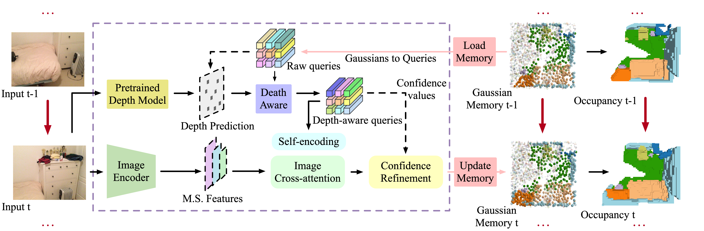

# EmbodiedOcc: Embodied 3D Occupancy Prediction for Vision-based Online Scene Understanding
### [Paper](https://arxiv.org/abs/2412.04380)  | [Project Page](https://ykiwu.github.io/EmbodiedOcc/) 

> EmbodiedOcc: Embodied 3D Occupancy Prediction for Vision-based Online Scene Understanding

> Yuqi Wu, [Wenzhao Zheng](https://wzzheng.net/)$\dagger$, [Sicheng Zuo](https://scholar.google.com/citations?user=11kh6C4AAAAJ&hl=en&oi=ao), [Yuanhui Huang](https://scholar.google.com/citations?hl=zh-CN&user=LKVgsk4AAAAJ), [Jie Zhou](https://scholar.google.com/citations?user=6a79aPwAAAAJ&hl=en&authuser=1), [Jiwen Lu](http://ivg.au.tsinghua.edu.cn/Jiwen_Lu/)

$\dagger$ Project leader

EmbodiedOcc formulate **an embodied 3D occupancy prediction task** and propose a Gaussian-based framework to accomplish it.


## Overview

Targeting progressive embodied exploration in indoor scenarios, we formulate an embodied 3D occupancy prediction task and propose a Gaussian-based EmbodiedOcc framework accordingly.
Our EmbodiedOcc maintains an explicit Gaussian memory of the current scene and updates this memory during the exploration of this scene.
Both quantitative and visualization results have shown that our EmbodiedOcc outperforms existing methods in terms of local occupancy prediction and accomplishes the embodied occupancy prediction task with high accuracy and strong expandability.



## Getting Started

### Installation
Follow instructions [HERE](docs/installation.md) to prepare the environment.

### Data Preparation
1. Prepare **posed_images** and **gathered_data** following the [Occ-ScanNet dataset](https://huggingface.co/datasets/hongxiaoy/OccScanNet) and move them to **data/occscannet**.

2. Download **global_occ_package** and **streme_occ_new_package** from the [EmbodiedOcc-ScanNet](https://huggingface.co/datasets/YkiWu/EmbodiedOcc-ScanNet).
Unzip and move them to **data/scene_occ**.

**Folder structure**
```
EmbodiedOcc
├── ...
├── data/
│   ├── occscannet/
│   │   ├── gathered_data/
│   │   ├── posed_images/
│   │   ├── train_final.txt
│   │   ├── train_mini_final.txt
│   │   ├── test_final.txt
│   │   ├── test_mini_final.txt
│   ├── scene_occ/
│   │   ├── global_occ_package/
│   │   ├── streme_occ_new_package/
│   │   ├── train_online.txt
│   │   ├── train_mini_online.txt
│   │   ├── test_online.txt
│   │   ├── test_mini_online.txt
```

### Train

1. Train local occupancy prediction module using 8 GPUs on Occ-ScanNet and Occ-ScanNet-mini2:
    ```
    $ cd EmbodiedOcc
    $ torchrun --nproc_per_node=8 train_mono.py --py-config config/train_mono_config.py
    $ torchrun --nproc_per_node=8 train_mono.py --py-config config/train_mono_mini_config.py
    ```
2. Train EmbodiedOcc using 8 GPUs on EmbodiedOcc-ScanNet and 4 GPUs on EmbodiedOcc-ScanNet-mini:
    ```
    $ cd EmbodiedOcc
    $ torchrun --nproc_per_node=8 train_embodied.py --py-config config/train_embodied_config.py
    $ torchrun --nproc_per_node=4 train_embodied.py --py-config config/train_embodied_mini_config.py
    ```

### Visualize

1. Local occupancy prediction:
    ```
    $ cd EmbodiedOcc
    $ torchrun --nproc_per_node=1 vis_mono.py --work-dir workdir/train_mono 
    $ torchrun --nproc_per_node=1 vis_mono.py --work-dir workdir/train_mono_mini
    ```

2. Embodied occupancy prediction:
    ```
    $ cd EmbodiedOcc
    $ torchrun --nproc_per_node=1 vis_embodied.py --work-dir workdir/train_embodied
    $ torchrun --nproc_per_node=1 vis_embodied.py --work-dir workdir/train_embodied_mini
    ```

Please use the same workdir path with training set.

## Related Projects

Our work is inspired by these excellent open-sourced repos:
[GaussianFormer](https://github.com/huang-yh/GaussianFormer)
[ISO](https://github.com/hongxiaoy/ISO)

Our code is based on [GaussianFormer](https://github.com/huang-yh/GaussianFormer).

## Citation

If you find this project helpful, please consider citing the following paper:
```
@article{wu2024embodiedoccembodied3doccupancy,
      title={EmbodiedOcc: Embodied 3D Occupancy Prediction for Vision-based Online Scene Understanding}, 
      author={Yuqi Wu and Wenzhao Zheng and Sicheng Zuo and Yuanhui Huang and Jie Zhou and Jiwen Lu},
      journal={arXiv preprint arXiv:2412.04380},
      year={2024}
}
```
